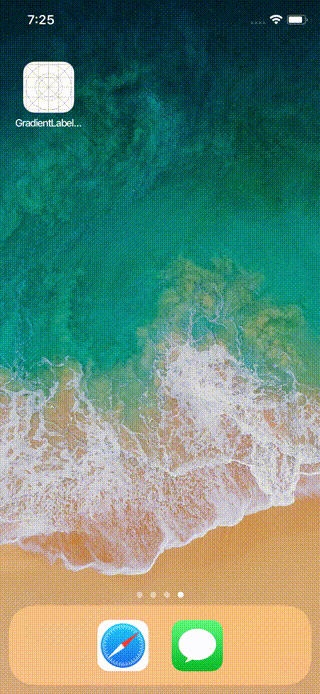

GradientLabel
======


## What's this

`UILabel` + `UIView.mask` + `CAGradientLayer`


## Features

- Completely supports AutoLayout
- Realtime previewing InterfaceBuilder with `@IBDesignable` and `@IBInspectable`


## Sample

```swift
DispatchQueue.main.asyncAfter(deadline: .now() + 1.0) {
    self.gradientLabel.startColor = .purple
    self.gradientLabel.endColor = .green
    self.gradientLabel.text = "async after 1"
    self.gradientLabel.font = .boldSystemFont(ofSize: 60.0)
    DispatchQueue.main.asyncAfter(deadline: .now() + 1.0) {
        self.gradientLabel.text = "async after 2"
        self.gradientLabel.font = .systemFont(ofSize: 20.0)
        self.gradientLabel.startColor = .yellow
        self.gradientLabel.endColor = .white
    }
}
```


